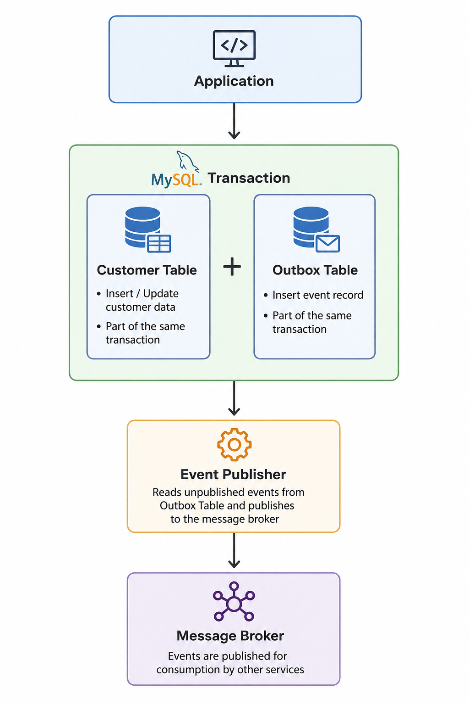

# Reliable Event Publishing with the Transactional Outbox Pattern

## Why this repository exists

I have seen a surprising number of systems assume that saving data and publishing an event are effectively the same operation.

They are not.

A database transaction can succeed while a message broker is unavailable. A broker can acknowledge a message while the application crashes before the database commit. The gap between those two actions is small enough to ignore during development and large enough to cause problems in production.

This repository explores that gap.

The project starts with a straightforward implementation of the Transactional Outbox Pattern using Spring Boot and MySQL. Later iterations will introduce Change Data Capture (CDC) with Debezium and eventually Apache Kafka.

The goal is not to build the most sophisticated event-driven platform possible. The goal is to build something reliable first, then evolve it in stages.

---

## The problem nobody notices at first

Imagine a customer registration service.

A request arrives.

The application saves a new customer record.

Immediately afterward it publishes a `CustomerCreated` event.

At first glance this feels perfectly reasonable.

```java
customerRepository.save(customer);

eventPublisher.publish(
    new CustomerCreatedEvent(customer)
);
```

Then reality intervenes.

The database commit succeeds.

Kafka is unavailable.

The application crashes.

Now the customer exists.

The event does not.

Nothing downstream knows that customer was created.

Inventory systems miss updates. Notification services remain silent. Analytics data drifts away from reality.

The database says one thing.

The rest of the platform says another.

That inconsistency is the dual-write problem.

The term sounds technical. The failure mode is painfully ordinary.

Two systems need to be updated.

One succeeds.

One fails.

---

## Why not just use distributed transactions?

In theory, distributed transactions solve the problem.

In practice, most modern microservice platforms avoid them.

They add coordination overhead.

They increase coupling.

They become difficult to reason about under failure conditions.

I have rarely seen engineers become enthusiastic after hearing the phrase "two-phase commit."

Most teams eventually look for something simpler.

---

## Enter the Transactional Outbox Pattern

The Outbox Pattern takes a different approach.

Instead of trying to update the database and publish an event simultaneously, it treats event publication as data.

That distinction matters.

When a customer is created, the application writes two records inside the same database transaction.

```text
Customer Table
      +
Outbox Table
```

Both commits succeed.

Or neither does.

No middle state exists.

A simplified transaction looks like this:

```sql
BEGIN;

INSERT INTO customer (...);

INSERT INTO outbox (
    event_id,
    event_type,
    payload,
    created_at
);

COMMIT;
```

The event is not sent immediately.

It is stored.

Almost like leaving a note on your own desk before walking out of the room.

A separate process later reads the Outbox table and publishes those events.

```text
# Transactional Outbox Pattern

## Architecture Diagram



```

Simple. Slightly less glamorous than a distributed transaction.

Far more dependable.

---

## What happens during failures?

This is where the pattern earns its keep.

Suppose Kafka is unavailable.

The customer record is already committed.

The Outbox record is already committed.

The publisher attempts delivery.

Delivery fails.

Nothing disappears.

The event remains in the Outbox table waiting for another attempt.

A few minutes later the broker recovers.

The publisher retries.

The event is delivered.

No manual intervention.

No detective work.

No uncomfortable production call asking whether data can be reconstructed from backups.

The database already contains the answer.

---

## A note about polling

This first implementation uses a polling publisher.

A scheduled process periodically scans the Outbox table and publishes pending events.

Some engineers dislike polling immediately.

I understand the reaction.

Yet polling has one advantage that often gets overlooked.

It is easy to understand.

You can inspect the database.

You can see pending events.

You can trace failures.

You can explain the entire mechanism on a whiteboard without opening five architecture diagrams.

That simplicity is useful while learning the pattern.

---

## Current implementation

Technology stack:

* Java
* Spring Boot
* Spring Data JPA
* MySQL
* Scheduled Event Publisher

Implemented features:

* Customer creation workflow
* Transactional Outbox persistence
* Atomic database transaction
* Event serialization
* Polling-based event publisher
* Event status tracking
* Retry-ready design

---

## Example flow

A customer registration request arrives.

```text
POST /customers
```

The application executes a single transaction.

```text
1. Save Customer
2. Save Outbox Event
3. Commit Transaction
```

Later:

```text
Publisher
    |
    v
Read Outbox Records
    |
    v
Publish Event
    |
    v
Mark As Published
```

The event eventually reaches downstream consumers.

Not because the network behaved perfectly.

Not because infrastructure never failed.

Because the system was designed with failure in mind from the beginning.

---

## Roadmap

This repository intentionally evolves in stages.

### Phase 1 — Transactional Outbox

Current phase.

Focus:

* Reliable event creation
* Atomic persistence
* Polling publisher
* Event status management

---

### Phase 2 — Debezium CDC

Planned.

Polling works, but it repeatedly asks the database whether something changed.

Debezium takes a different route.

Instead of querying tables, it reads the MySQL binary log and captures changes directly.

Expected additions:

* Debezium
* Kafka Connect
* MySQL Binlog integration
* Automatic Outbox event capture

Architecture:

```text
MySQL
   |
   v
Binlog
   |
   v
Debezium
   |
   v
Kafka
```

The application becomes smaller because event publication no longer depends on a polling scheduler.

---

### Phase 3 — Apache Kafka

Planned.

At this stage the repository moves beyond reliable event creation and into event streaming.

Expected additions:

* Kafka Topics
* Consumer Services
* Retry Strategies
* Dead Letter Queues
* Event Replay
* Observability

Architecture:

```text
Service
   |
Outbox
   |
Debezium
   |
Kafka
   |
Consumers
```

The interesting part is not Kafka itself.

It is watching how a simple database transaction gradually becomes part of a larger event-driven system.

---

## Running the project

Clone the repository:

```bash
git clone https://github.com/<your-username>/<repository-name>.git
```

Start MySQL.

Configure application properties.

Run the application:

```bash
mvn spring-boot:run
```

Create a customer.

Inspect the database.

Look at the Outbox table.

That table is really the heart of the project.

Everything else grows outward from there.

---

## Closing thought

Most software discussions eventually drift toward scale.

More traffic.

More services.

More infrastructure.

Reliability is often less dramatic.

It begins with a quieter question.

What happens when something fails halfway through?

The Transactional Outbox Pattern is one answer to that question.

Not the only answer.

But in my experience, it is one of the most practical.
