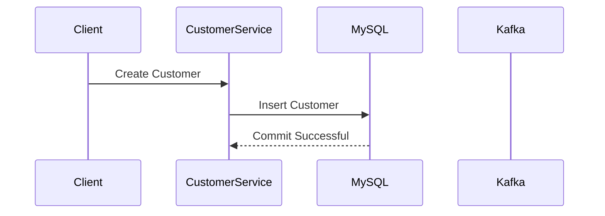
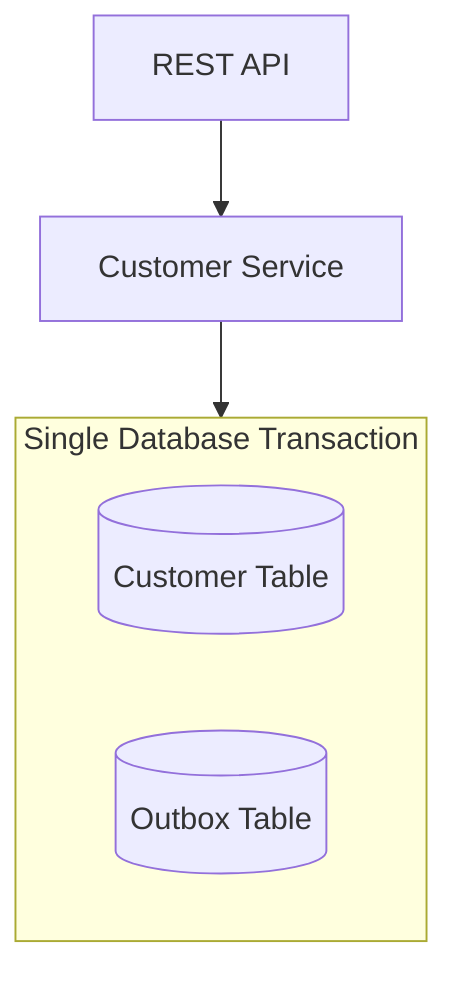
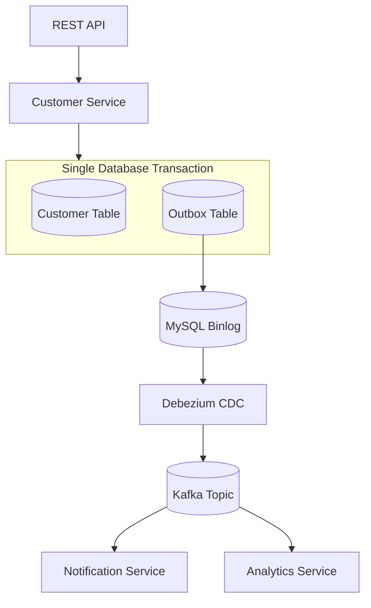
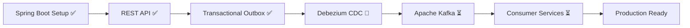
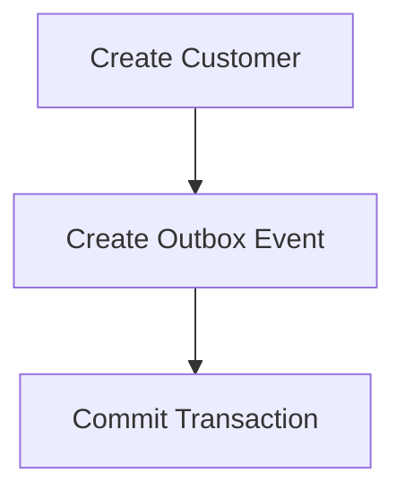
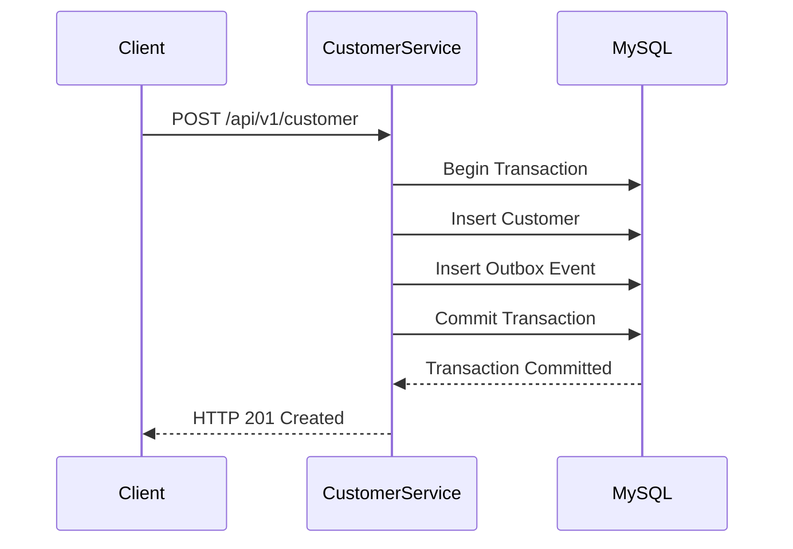
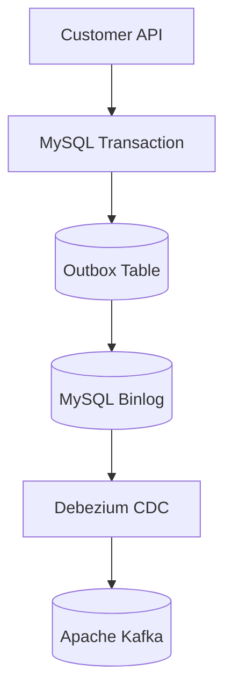
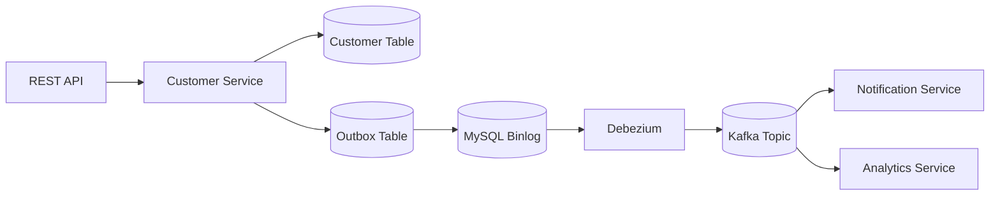

# MySQL CDC with the Transactional Outbox Pattern


> A hands-on project demonstrating reliable event publishing using the Transactional Outbox Pattern, with incremental integration of Debezium-Change Data Capture (CDC), and Apache Kafka.

---
## Table of Contents

- [Project Overview](#project-overview)
- [Objectives](#objectives)
- [Technology Stack](#technology-stack)
- [High-Level Project Architecture](#high-level-project-architecture)
- [Low-Level Project Architecture](docs/system_architecture/End-to-End_Event_Flow_Architecture.md)
- [Project Roadmap](#project-roadmap)
- [Project Progress](#project-progress)
- [Repository Roadmap](#repository-roadmap)
- [Current Implementation](#current-implementation)
- [Transactional Outbox Flow](#transactional-outbox-flow)
- [Verification](#verification)
- [Why the Outbox Pattern](#why-the-outbox-pattern)
- [Debezium-CDC Integration](#next-phase-debezium-cdc)
- [Target Architecture](#end-to-end-event-flow-target-architecture)
- [Project Deployment](#running-the-project)
- [Learning Outcomes](#learning-outcomes)

---
[↑ Back to Top](#table-of-Contents)
## Project Overview

Modern distributed systems often rely on events to keep multiple services synchronized. A common mistake is assuming that saving data to a database and publishing an event are a single operation.

In reality, these are two separate actions that can fail independently.

Consider a customer registration service:


```mermaid
sequenceDiagram
    participant Client
    participant CustomerService
    participant MySQL
    participant Kafka

    Client->>CustomerService: Create Customer
    CustomerService->>MySQL: Insert Customer
    MySQL-->>CustomerService: Commit Successful
```

1. A customer is successfully saved to the database.
2. An event should be published to notify other services.
3. The application crashes before the event is sent.

The customer now exists in the database, but no downstream system knows about it.

This inconsistency is known as the **Dual-Write Problem**, and it becomes increasingly difficult to manage as systems grow.

This repository explores one of the most widely adopted solutions to this challenge—the **Transactional Outbox Pattern**—and demonstrates how it evolves into a complete event-driven architecture using **Debezium** and **Apache Kafka**.

Rather than building everything at once, the project is intentionally developed in phases, allowing each concept to be implemented, verified, and documented independently.

---
[↑ Back to Top](#table-of-Contents)
## Objectives

The primary goals of this project are to:

- Understand the Dual-Write Problem
- Implement the Transactional Outbox Pattern
- Ensure reliable event creation using a single database transaction
- Integrate Debezium for Change Data Capture (CDC)
- Publish events to Apache Kafka
- Build an end-to-end event-driven workflow using modern technologies

---
[↑ Back to Top](#table-of-Contents)
## Technology Stack

- Java 21
- Spring Boot
- Spring Data JPA
- MySQL
- Maven
- Debezium *(Planned)*
- Apache Kafka *(Planned)*
- Docker *(Planned)*

---
[↑ Back to Top](#table-of-Contents)
## High-Level Project Architecture

**Current Architecture**


```mermaid
       flowchart TD
    A[REST API] --> B[Customer Service]
    B --> C

    subgraph C["Single Database Transaction"]
        direction LR
        D[(Customer Table)]
        E[(Outbox Table)]
    end
```

**Future Architecture**


```mermaid
              flowchart TD
    A[REST API] --> B[Customer Service]
    B --> C

    subgraph C["Single Database Transaction"]
        direction LR
        D[(Customer Table)]
        E[(Outbox Table)]
    end

    E --> F[(MySQL Binlog)]
    F --> G[Debezium CDC]
    G --> H[(Kafka Topic)]

    H --> I[Notification Service]
    H --> J[Analytics Service]
```
---
[↑ Back to Top](#table-of-Contents)
## Low-Level Project Architecture

The following hyperlink provides detailed information about the system architecture.

### [Low-Level Project Architecture](docs/system_architecture/End-to-End_Event_Flow_Architecture.md)
---
[↑ Back to Top](#table-of-Contents)
## Project Roadmap

- [Phase 1 – Project Setup](docs/phase-1-project-setup.md)
- [Phase 2 – REST API](docs/phase-2-rest-api.md)

---
## Project Progress

| Phase | Description | Status |
|--------|-------------|--------|
| Phase 1 | Spring Boot Project Setup | ✅ Completed |
| Phase 2 | Customer REST API | ✅ Completed |
| Phase 3 | Transactional Outbox Pattern | ✅ Completed |
| Phase 4 | Debezium CDC Integration | 🚧 In Progress |
| Phase 5 | Apache Kafka Integration | ⏳ Planned |
| Phase 6 | Consumer Services | ⏳ Planned |

---
[↑ Back to Top](#table-of-Contents)
## Repository Roadmap


```mermaid
flowchart LR
    A[Spring Boot Setup ✅]
    B[REST API ✅]
    C[Transactional Outbox ✅]
    D[Debezium CDC 🚧]
    E[Apache Kafka ⏳]
    F[Consumer Services ⏳]
    G[Production Ready]

    A --> B --> C --> D --> E --> F --> G
```
---
[↑ Back to Top](#table-of-Contents)
## Current Implementation

The application currently supports:

- Customer creation REST API
- Transactional persistence of Customer and Outbox Event
- Atomic database transactions using Spring's `@Transactional`
- Event payload serialization
- RESTful API design
- MySQL persistence

Customer creation endpoint:

```
POST /api/v1/customer
```

During a single transaction the application performs:


```mermaid
flowchart TD
    A[Create Customer]
    B[Create Outbox Event]
    C[Commit Transaction]

    A --> B
    B --> C
```

Both records are committed together.

If the transaction fails, neither record is persisted, ensuring the database remains consistent.

---
[↑ Back to Top](#table-of-Contents)
## Transactional Outbox Flow

The following sequence illustrates how the application guarantees reliable event creation.


```mermaid
sequenceDiagram
    participant Client
    participant CustomerService
    participant MySQL

    Client->>CustomerService: POST /api/v1/customer

    CustomerService->>MySQL: Begin Transaction
    CustomerService->>MySQL: Insert Customer
    CustomerService->>MySQL: Insert Outbox Event
    CustomerService->>MySQL: Commit Transaction

    MySQL-->>CustomerService: Transaction Committed

    CustomerService-->>Client: HTTP 201 Created
```
---
[↑ Back to Top](#table-of-Contents)
## Verification

The current implementation has been verified by confirming that:

- A customer record is successfully persisted.
- A corresponding outbox event is created.
- Both records are committed within the same transaction.
- No partial writes occur.

Artifacts demonstrating these results are available under the `docs` directory.

---
[↑ Back to Top](#table-of-Contents)
## Why the Outbox Pattern?

Instead of attempting to update the database and publish an event simultaneously, the Transactional Outbox Pattern stores the event alongside the business data inside the same database transaction.

This guarantees that:

- Customer data and event information remain consistent.
- Events are never published for failed transactions.
- Failed event publication can be retried without losing business data.
- Event delivery becomes resilient to infrastructure failures.

This approach removes the risk associated with dual writes while providing a reliable foundation for event-driven systems.

---
[↑ Back to Top](#table-of-Contents)
## Next Phase: Debezium CDC

The next milestone is integrating **Debezium**.

Rather than polling the Outbox table, Debezium monitors the MySQL binary log and automatically captures committed database changes.

The expected event flow will become:


```mermaid

flowchart TD
    A[Customer API]
    B[MySQL Transaction]
    C[(Outbox Table)]
    D[(MySQL Binlog)]
    E[Debezium CDC]
    F[(Apache Kafka)]

    A --> B
    B --> C
    C --> D
    D --> E
    E --> F
```

This removes the need for scheduled polling and enables near real-time event streaming.

---
[↑ Back to Top](#table-of-Contents)
## Future Enhancements

---
[↑ Back to Top](#table-of-Contents)
### End-to-End Event Flow (Target Architecture)


```mermaid

flowchart LR
    A[REST API]
    B[Customer Service]
    C[(Customer Table)]
    D[(Outbox Table)]
    E[(MySQL Binlog)]
    F[Debezium]
    G[(Kafka Topic)]
    H[Notification Service]
    I[Analytics Service]

    A --> B
    B --> C
    B --> D
    D --> E
    E --> F
    F --> G
    G --> H
    G --> I
```
---
[↑ Back to Top](#table-of-Contents)
Planned improvements include:

- Debezium Outbox Connector
- Kafka Topics
- Kafka Consumer Services
- Retry and Backoff Strategies
- Dead Letter Queue (DLQ)
- Event Replay
- Docker Compose Environment
- Monitoring and Observability

---
[↑ Back to Top](#table-of-Contents)
## Running the Project

Clone the repository:

```bash
git clone https://github.com/mwapevi/springboot-outbox-pattern_debezium_kafka.git
```

Navigate to the project directory:

```bash
cd springboot-outbox-pattern_debezium_kafka
```

Configure your MySQL database in `application.properties`.

Run the application:

```bash
mvn spring-boot:run
```

Test the API:

```
POST http://localhost:6666/api/v1/customer

```

Verify that both the `customer` and `outbox_event` tables contain the expected records.

---
[↑ Back to Top](#table-of-Contents)
## Learning Outcomes

This project has helped me gain practical experience with:

- Designing RESTful APIs
- Spring Boot application development
- Transaction management
- The Transactional Outbox Pattern
- Reliable event publishing
- Preparing applications for Change Data Capture (CDC)
- Building event-driven architectures incrementally

---
## Author

**Victor Mwape**

GitHub: [mwapevi](https://github.com/mwapevi)

Areas of Interest:
- Backend Engineering
- Fintech Infrastructure
- Event-Driven Systems
- API Integrations
- Data Engineering
---
[↑ Back to Top](#table-of-Contents)


