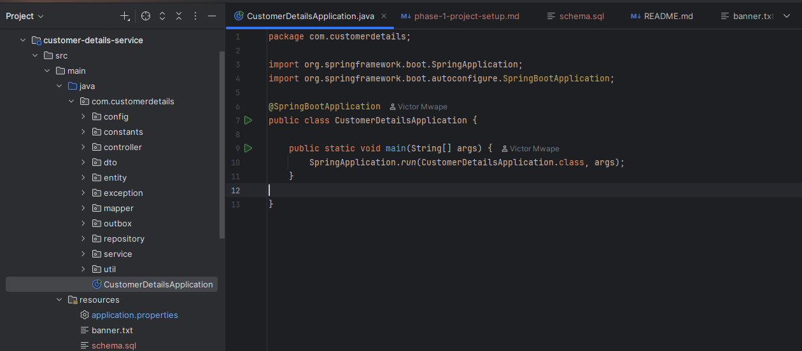
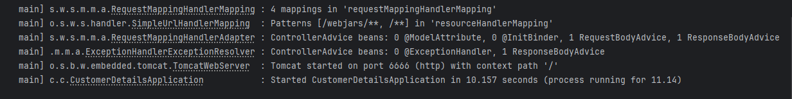
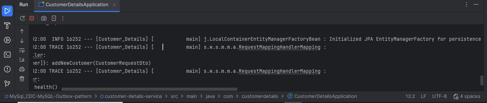
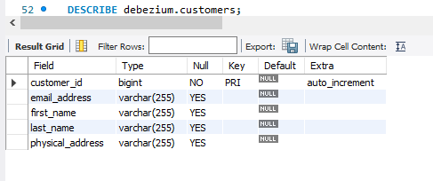
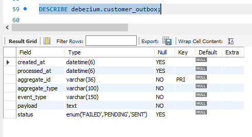

← [Back to README](/README.md)

## Project Overview

In this phase, we create the Spring Boot project, configure the required dependencies, connect to MySQL, and verify that the application starts successfully. This establishes the foundation for the remaining phases of the project.

## Prerequisites

The following is a list of software required to implement this project.

- **Java 21**
- **Maven 3.9+**
- **MySQL 8**
- **Git**
- **IntelliJ IDEA**
- **Docker Desktop**

## Create the Project

This project was built using the following technologies:

- **Spring Boot: 3.5.4**
- **Java: 21**
- **Maven: 3.9**
- **Packaging: JAR**

Dependencies:

- **Spring Web**
- **Spring Data JPA**
- **MySQL Driver**
- **Lombok**
- **Validation**
- **Jackson**
- **Mapstruct**

## Project Structure

```text
customer-details-service
└──src
│  └── main
│      ├── java
│      │  └── com.customerdetails
│      │      ├── config
│      │      ├── constants
│      │      ├── controller
│      │      ├── dto
│      │      ├── entity
│      │      ├── exception
│      │      ├── mapper
│      │      ├── outbox
│      │      ├── repository
│      │      ├── service
│      │      ├──util
│      │      └── CustomerDetailsApplication.java
│      │
│      └── resources
│          ├── application.properties
│          ├── banner.txt
│          └── schema.sql
└──pom.xml

```
## Configure MySQL Database

application.properties:

- **Database Connection URL**
  Define the connection URL that Spring Boot uses to connect the application to MySQL database.
 ```properties
spring.datasource.url=jdbc:mysql://localhost:3306/mysqldb
 ```
- **Database Username**
Define the username Spring Boot will use to authenticate with MySQL database.
 ```properties
spring.datasource.username=mysqlusername
 ```
- **Database Password**
Define the password Spring Boot will use to connect to MySQL database.
```properties
spring.datasource.password=mysqlpassword
```
## Configure JPA

```properties
spring.jpa.hibernate.ddl-auto=update
spring.jpa.show-sql=true
```
 
## Verify the Connection

Verify and ensure that the DB connection completed successfully as follows:

```Logs

2026-07-08T23:13:32.175+02:00  INFO 18940 --- [Customer_Details] [           main] com.zaxxer.hikari.HikariDataSource       : HikariPool-1 - Starting...
2026-07-08T23:13:34.498+02:00  INFO 18940 --- [Customer_Details] [           main] com.zaxxer.hikari.pool.HikariPool        : HikariPool-1 - Added connection com.mysql.cj.jdbc.ConnectionImpl@18a096b5
2026-07-08T23:13:34.500+02:00  INFO 18940 --- [Customer_Details] [           main] com.zaxxer.hikari.HikariDataSource       : HikariPool-1 - Start completed.
...Database JDBC URL [Connecting through datasource 'HikariDataSource (HikariPool-1)']

```
## Run the Application

Run the application (mvn spring-boot:run) and confirm that the application starts on port 6666 successfully.

```Logs

18940 --- [Customer_Details] [           main] o.s.b.w.embedded.tomcat.TomcatWebServer  : Tomcat started on port 6666 (http) with context path '/'
2026-07-08T23:13:41.047+02:00  INFO 18940 --- [Customer_Details] [           main] c.c.CustomerDetailsApplication           : Started CustomerDetailsApplication in 16.691 seconds (process running for 19.255)

```

## Verify the REST Endpoint

**Test Endpoint:**

```Endpoint
GET http://localhost:6666/api/health

```
**Response:** 
```Logs
Application is running

```

## Screenshots

The following screenshots demonstrate the successful completion of Phase 1 setup.

### Open Project in IntelliJ


### Application Startup


### Database Connection


### Database Tables



## What We achieved

At the end of this phase we have:

- Created the Customer Details Spring Boot application.
- Connected the application to MySQL.
- Verified the application starts successfully.

With this project foundation complete, the next phase focuses on implementing the Customer REST API.

← [Back to README](/README.md)


