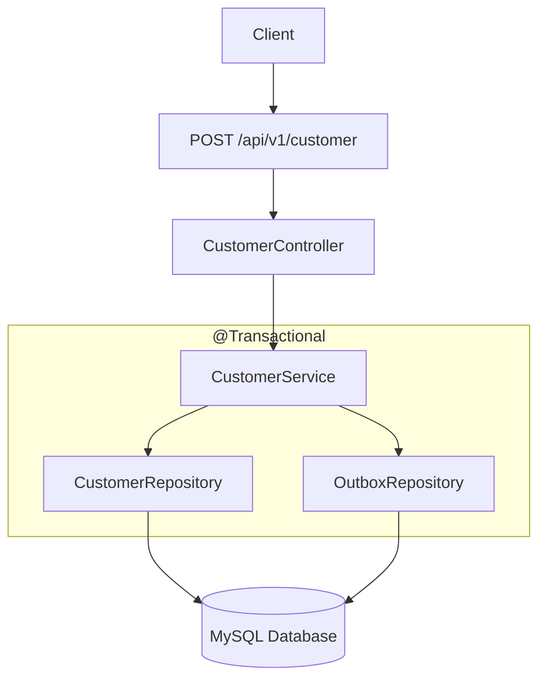

# 1 Overview

In this phase, the application exposes a REST API that allows clients to Customers Service.

The API receives an HTTP request, validates the incoming data, maps it to a domain entity, and persists it in MySQL using Spring Data JPA.

At this stage, the application focuses solely on persisting data. Event publishing is introduced in the following phases.

# 2 Objectives
- Build a REST endpoint for creating Customers.
- Introduce the Customer Service layer.
- Persist data using Spring Data JPA.
- Separate responsibilities between controller, service, and repository.

# 3 Components Created

**CustomerController**

Responsible for handling incoming HTTP requests.

Example endpoint:
```properties
http://localhost:6666/api/v1/customer
```
Responsibilities:

- Accept JSON requests
- Delegate business logic to the CustomerService layer
- Return appropriate HTTP responses, i.e. 201

**CustomerService**

Contains the application's business logic.

Responsibilities:

- Validate incoming requests (if applicable)
- Create a Customer entity
- Save the entity using the repository

**CustomerRepo**

Spring Data JPA repository responsible for database access.
```properties
@Repository
public interface CustomerRepo extends JpaRepository<Customer, UUID> {
}
```
**OutboxRepo**

Spring Data JPA repository responsible for database access.

```properties
@Repository
public interface OutboxRepo extends JpaRepository<CustomerOutbox, UUID> {
}
```

**Customer Entity**

Represents the Customers table.

Example fields:

id
customerId
firstLame
lastName
emailAddress
physicalAddress

**Customer Outbox Entity**

Represents the CustomerOutbox table.

Example fields:

Id
aggregateType
eventType
payload
status
createdAt
processedAt

**API Request Flow**



# 4 Testing the API

The endpoint can be tested using Postman.

**Request**
```post
POST http://localhost:6666/api/v1/customer

Content-Type: application/json
```
```JSON
{
"customerId":"0011",
"firstName":"Victor",
"lastName": "Mwape",
"emailAddress":"victormwape2012@gmail.com",
"physicalAddress":"267 Outlook Terrace, Blackheath, Joahnesburg"
}
```
**Successful Response**

✅ HTTP 201 Created

```JSON

{
    "customerId": 1,
    "firstName": "Victor",
    "lastName": "Mwape",
    "emailAddress": "victormwape2012@gmail.com",
    "physicalAddress": "267 Outlook Terrace, Blackheath, Joahnesburg"
}
```
# 5 Database Verification

After a successful request, verify that the both Customers and CustomerOutbox have been persisted with the same transaction.

```SQL

SELECT * FROM Customers;

SELECT * FROM CustomerOutbox;

```
You should see the newly created Customer record in both database tables.

# 6 Screenshots

Please refer to the following image artifacts in docs/artifacts/phase-2/

Screenshots include:

- **API Request simulation to the endpoint in Postman**
- **Successful API response**
- **Successful response in the logs**
- **Customer record persisted in Customers Database Table**
- **Customer record persisted in CustomerOutbox Database Table**

# 7 Summary

By the end of this phase, the application can receive HTTP requests and persist Customer records to the database using a layered Spring Boot architecture with the Transactional Outbox Pattern. This establishes the foundation for the next phase, where Debezium-Change Data Capture will be introduced to ensure that database changes and event publication remain reliable and consistent.

