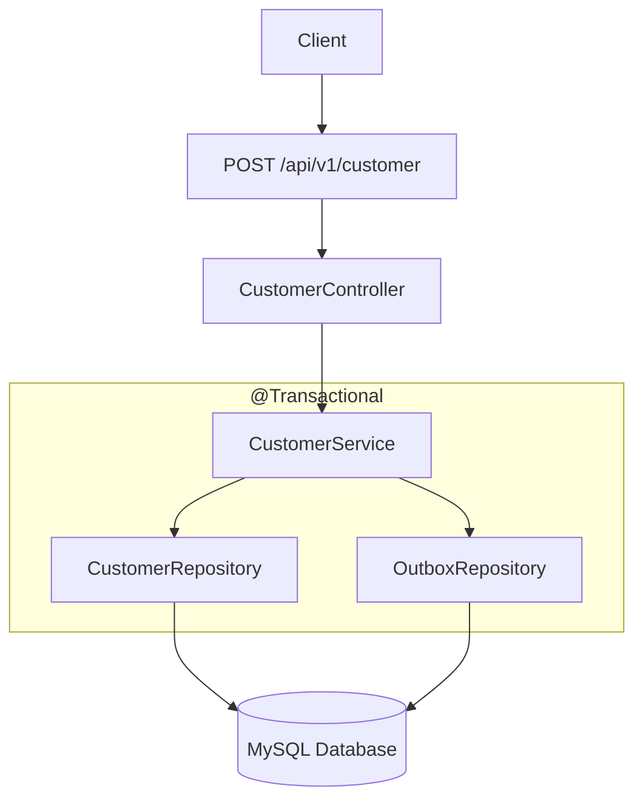
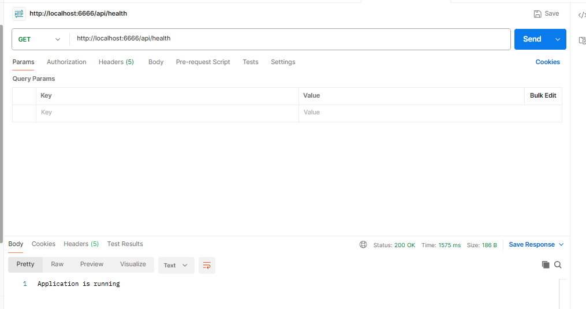
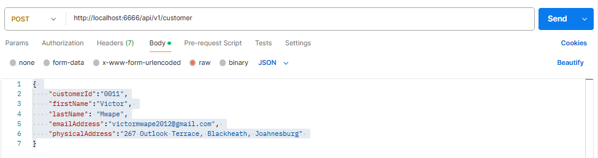
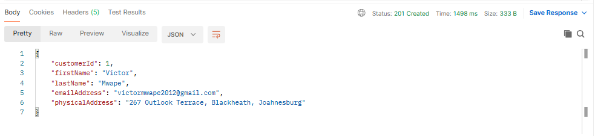
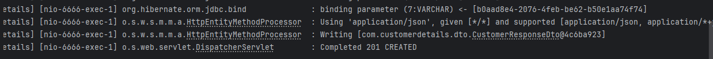
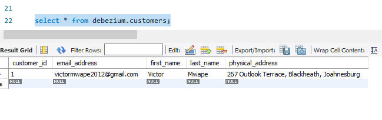
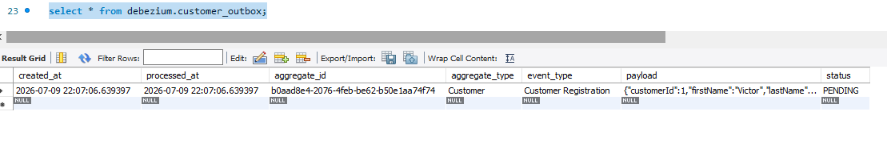

← [Back to README](/README.md)

## Overview

In this phase, the application exposes a REST API endpoint that allows clients to interact with Customers Service.

The API receives an HTTP request, validates the incoming data, maps it to a domain entity, and persists it in MySQL using Spring Data JPA.

At this stage, the application focuses solely on persisting data. Event publishing is introduced in the following phases.

## Objectives
---
- Build a REST endpoint for creating Customers.
- Introduce the Customer Service layer.
- Persist data using Spring Data JPA.
- Separate responsibilities between controller, service, and repository.

## Components Created

**CustomerController**

- The component responsible for handling incoming HTTP requests.

Example endpoint:

```properties
http://localhost:6666/api/v1/customer
```
Responsibilities:

- Accept JSON requests
- Delegate business logic to the CustomerService layer
- Return appropriate HTTP responses, i.e. 201

**CustomerService**

- This component presents the application's business logic.

Responsibilities:

- Validate incoming requests (if applicable)
- Create a Customer entity
- Save the entity using the repository

**CustomerRepo**

- This is a Spring Data JPA repository responsible for database access.

```properties
@Repository
public interface CustomerRepo extends JpaRepository<Customer, UUID> {
}
```
**OutboxRepo**

- This is a Spring Data JPA repository responsible for database access.

```properties
@Repository
public interface OutboxRepo extends JpaRepository<CustomerOutbox, UUID> {
}
```

**Customer Entity**

- This represents Customer details in a Customers Database table.

Example fields:

- id
- customerId
- firstLame
- lastName
- emailAddress
- physicalAddress

**Customer Outbox Entity**

- This represents customer details in an CustomerOutbox database table.

Example fields:

- Id
- aggregateType
- eventType
- payload
- status
- createdAt
- processedAt

**API Request Flow**



## API Testing

The endpoint was tested in Postman as follows:

**Request**

```post

Content-Type: application/json

POST http://localhost:6666/api/v1/customer
```
```JSON
{
"customerId":"0011",
"firstName":"Victor",
"lastName": "Mwape",
"emailAddress":"victormwape2012@gmail.com",
"physicalAddress":"267 Outlook Terrace, Blackheath, Joahnesburg"
}
```
**Response**

```status
Status: HTTP 201 Created

```
```JSON

{
    "customerId": 1,
    "firstName": "Victor",
    "lastName": "Mwape",
    "emailAddress": "victormwape2012@gmail.com",
    "physicalAddress": "267 Outlook Terrace, Blackheath, Joahnesburg"
}
```
## Database Verification

Following a successful API testing, verification was performed to ensure that both Customers and CustomerOutbox were persisted in the same transaction.

```SQL

SELECT * FROM Customers;

SELECT * FROM CustomerOutbox;

```
Newly created Customer records in both database tables where observed.

## Screenshots

This section presents the artifacts captured during REST API testing, hence marking the completion of Phase-2 of the project implementation.

### API Status in Postman



### API Request/Response in Postman




### API Logs



### Customer Record Persistence



### CustomerOutbox Record Persistence



## Summary

By the end of this phase, the application can receive HTTP requests and persist Customer records to the database using a layered Spring Boot architecture with the Transactional Outbox Pattern. This establishes the foundation for the next phase, where Debezium-Change Data Capture will be introduced to ensure that database changes and event publication remain reliable and consistent.

← [Back to README](/README.md)