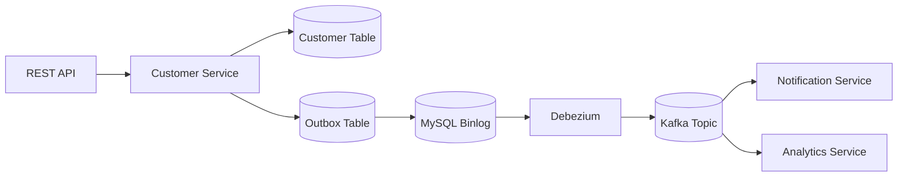

← [Back to README](/README.md)

## Architecture Overview

This architecture represents the Transactional Outbox Pattern with Change Data Capture (CDC) using Debezium and Kafka.



The architecture follows this event flow:

#### Client Request → Customer Service → Database Transaction → Outbox Event → MySQL Binlog → Debezium CDC → Kafka → Multiple Consumers


## REST API Request
 ### Component:
```component
 REST API
``` 
### Responsibility:

A client sends an HTTP request to create a customer on the following endpoint:
```API Endpoint
POST /api/v1/customer
```
Client examples include:

- Web applications
- Mobile applications
- Third-party systems
- Internal services

### Sample Client Request:

```Type
Content-Type: application/json
```
```JSON
{
"customerId":"0011",
"firstName":"Victor",
"lastName": "Mwape",
"emailAddress":"victormwape2012@gmail.com",
"physicalAddress":"267 Outlook Terrace, Blackheath, Joahnesburg"
}
```
### Sample Client Response:

[OK] HTTP 201 Created

```JSON

{
    "customerId": 1,
    "firstName": "Victor",
    "lastName": "Mwape",
    "emailAddress": "victormwape2012@gmail.com",
    "physicalAddress": "267 Outlook Terrace, Blackheath, Joahnesburg"
}
```
The API receives the request and forwards it to the Customer Service.

## Customer Service

Once an API request reaches the Customer Service component, it performs the following actions:

- Starts a database transaction.
- Updates the Customer table.
- Writes an event (such as "CustomerCreated") to the Outbox table.
- Commits both operations within the same transaction, ensuring data consistency.

## MySQL Binlog

MySQL records the insert into the Outbox table in its binary log (binlog).

## Debezium

Following the previous operation, Debezium continuously monitors the MySQL binary log (binlog) for new records inserted into the Outbox table. When a new record is detected, it publishes the corresponding event to Kafka.

## Kafka Topic

When Debezium publishes events to Kafka, they are durably stored in a Kafka topic. This allows multiple independent consumer services subscribed to the topic to consume and process the same events without affecting one another.

## Consumer Services

- A Consumer Service in this context is referred to as Notification Service that sends SMS, Emails and Push Notifications.
- Analytic Service is a consumer that updates the dashboards, metrics or Data Warehouses.


## Why this architecture?

This architecture is valuable in providing the following solutions in distributed systems:

- No dual-write problem - Maintains consistency between database and Kafka/Event stream
- Reliable event publishing 
- Loose coupling between services
- Easy to add new consumers without modifying the Customer Service
- Supports event-driven microservices and eventual consistency

← [Back to README](/README.md)

