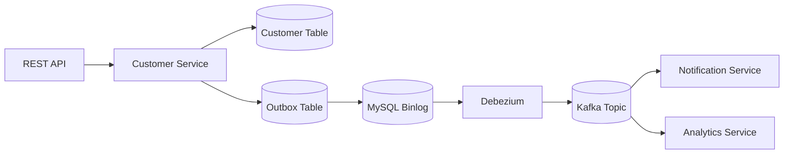

← [Back to README](../README.md)

## Architecture Overview



The architecture follows this event flow:

Client Request → Customer Service → Database Transaction → Outbox Event → MySQL Binlog → Debezium CDC → Kafka → Multiple Consumers

## 1. REST API
 ### Component:

```component
 REST API
```
 ### Responsibility:

The REST API is the entry point where external clients communicate with the system.

Examples:

- Web applications
- Mobile applications
- Third-party systems
- Internal services

```api

POST /api/v1/customer

```

A client sends a request:

```JSON

{
  "firstName": "Victor",
  "lastName": "Mwape",
  "emailAddress": "victor@example.com",
  "physicalAddress":"267 Outlook Terrace, Blackheath, Johannesburg"
}

```
The API receives the request and forwards it to the Customer Service.


← [Back to README](../README.md)

